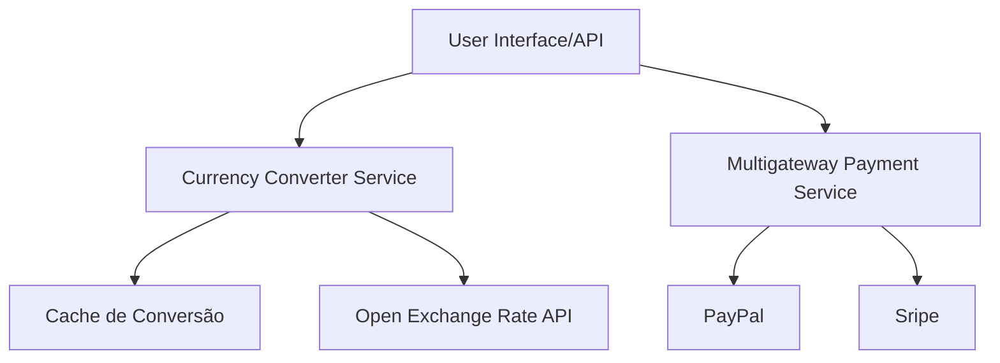
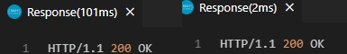

# desafiogolang-neo4j
Este repositório é um desafio de programação que simula um arquitetura multigateway e multimoeda para um sistema de cobranças e processos financeiros.

## Arquitetura


Descrição dos Componentes
1. Handlers/Back-end API: Interface onde os usuários iniciam as interações e onde as solicitações da API são recebidas.

2. Currency Converter Service: Serviço que lida com a conversão de moedas entre diferentes tipos.

3. Cache de Conversão: Um banco de dados em cache para armazenar dados recorrentes e evitar consultas repetidas na API externa.

3. Multigateway Payment Service: Serviço que integra diferentes gateways de pagamento para processar transações.

4. PayPal: Gateway de pagamento específico para transações via PayPal.

5. Stripe: Gateway de pagamento específico para transações via Stripe.


## Conversão de Moeda

Para realizar a conversão de moeda foi utilizada a API pública externa do Open Exchange Rates (https://openexchangerates.org/).

A solução foi projetada para consultar a API se o banco de dados em cache não possuir um valor de cotação referente à última hora. Caso o banco de dados possua essa informação, é consultado diretamente nele.

Para efeito de simplicidade, essa solução está feita em memória, mas idealmente deveria ser utilizado um banco de dados em cache (e.g. Redis).

Com essa abordagem, conseguimos reduzir o tempo de resposta da API significativamente, já que não necessita aguardar a resposta de uma API externa




## Solução Multigateway

Foi implementado uma lógica onde é simulado o processo de pagamento e consulta do mesmo via PayPal.

É gerado um status e ID de transação aleatórios ao efetuar uma transação ao endpoint de pagamento.

E é possível consultar esse status por meio do endpoint de consulta.

A ideia é simular de maneira bem simplificada o funcionamento da API do PayPal.

https://developer.paypal.com/docs/api/payments/v1/#payment_get
https://developer.paypal.com/docs/api/payments/v1/#payment_create

Para fins de simplicidade os dados são armazenados em memória durante o tempo de execução. Idealmente a solução deveria contemplar todas as variáveis descritas e utilizar um banco de dados para armazenamento de logs.


A solução possui também suporta ao gateway "Stripe", no entanto não foi feito nenhuma implementação nesse serviço e é meramente usado para ilustrar a solução multigateway. Portanto ao utilizar o parametro gateway: "Stripe", nada irá acontecer.


# Quickstart

```
git clone https://github.com/Geronaso/desafiogolang-payment.git
cd desafiogolang-payment
go mod tidy
go run .\main.go
```

Caso prefira via docker

```
docker build -t desafiogolang-payment .
docker run -p 8080:8080 desafiogolang-payment
```

## Documentação da API

A especificação da API está disponível no formato OpenAPI. Você pode visualizar e interagir com a documentação da API utilizando ferramentas como Swagger UI, Postman, ou qualquer outra que suporte OpenAPI.

### Arquivo OpenAPI

O arquivo de especificação OpenAPI pode ser encontrado em [`docs/openapi.yaml`](docs/openapi.yaml).

### Visualizando a Documentação

Para visualizar a documentação da API, você pode utilizar:

- [Swagger Editor](https://editor.swagger.io/): Carregue o arquivo `openapi.yaml` para visualizar e interagir com a API.
- [Postman](https://www.postman.com/): Importe o arquivo `openapi.yaml` para criar coleções de testes para a API.

### Endpoints

- `POST /process-payment`: Processa um pagamento.
- `GET /payment-status`: Obtém o status de um pagamento.
- `POST /convert-currency`: Converte moeda.

Veja a especificação completa no arquivo [openapi.yaml](docs/openapi.yaml).

### Arquivo http para testes

Também está disponibilizado no diretório o arquivo http_requests.http. Um arquivo com alguns exemplos pré montados de requests.


## Testes Integrados

Os testes estão localizados na pasta test, e podem ser executados:

```
go test .\test\
```

Foram escritos testes para as principais funcionalidades, que são os handlers. Os testes estão cobrindo aproximadamente 83% das funções escritas para os handlers. Por serem testes integrados, eles cobrem as funcionalidades dos services e models. Idealmente, deverão ser escritos testes unitários para os services e models também.

## Governança

Foi utilizado Clean Architecture para organização do código, como não há conexão com banco de dados a camada de repositório não está presente.

- Handlers: Lida com as solicitações HTTP e coordena a lógica da aplicação.

- Services: Contém a lógica de negócios e realiza operações que não são específicas do transporte HTTP.

- Models: Define as estruturas de dados que são usadas em várias partes do sistema.

- Testes: Testes isolados em pacotes separados para garantir a testabilidade e a independência de cada camada.


## Melhorias

- Utilização de uma camada de autenticação (JWT, OAuth 2.0)

- Utilização de logs

- Utilização de Banco de dados (Redis, Postgres)

- Monitoramento com ferramentas de observabilidade (Prometheus, DataDog, Grafana)


## Licença

Este projeto está licenciado sob a licença MIT. Veja o arquivo [LICENSE](LICENSE) para mais detalhes.

---

MIT License

